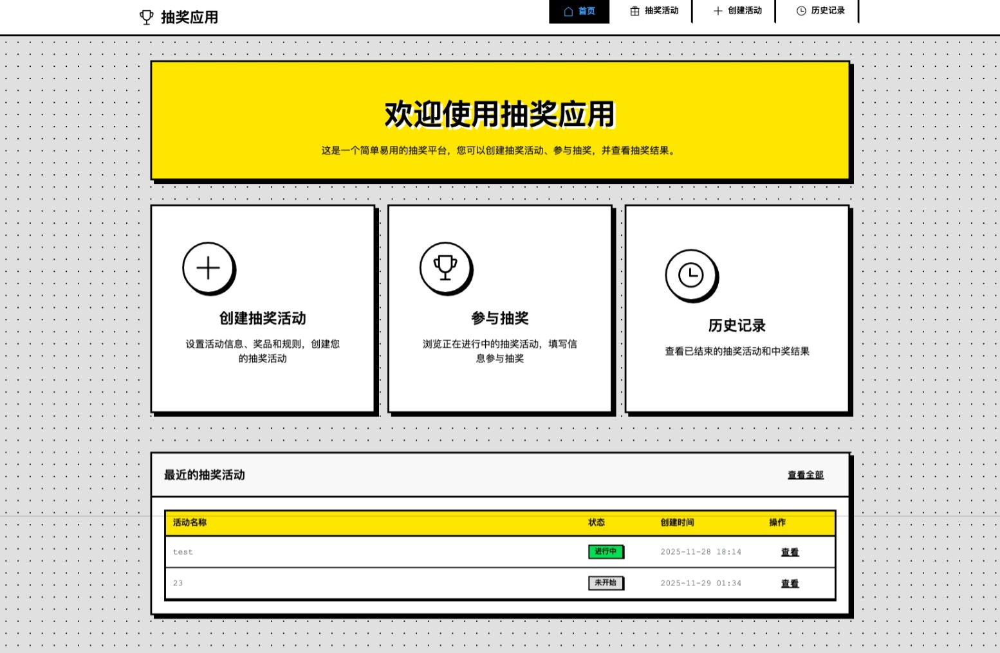
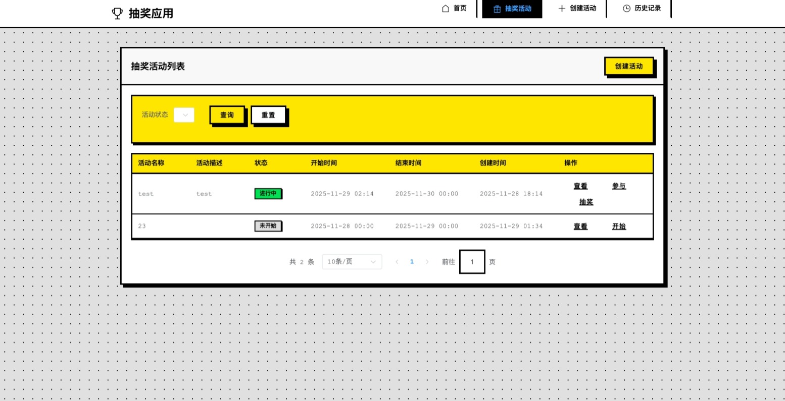
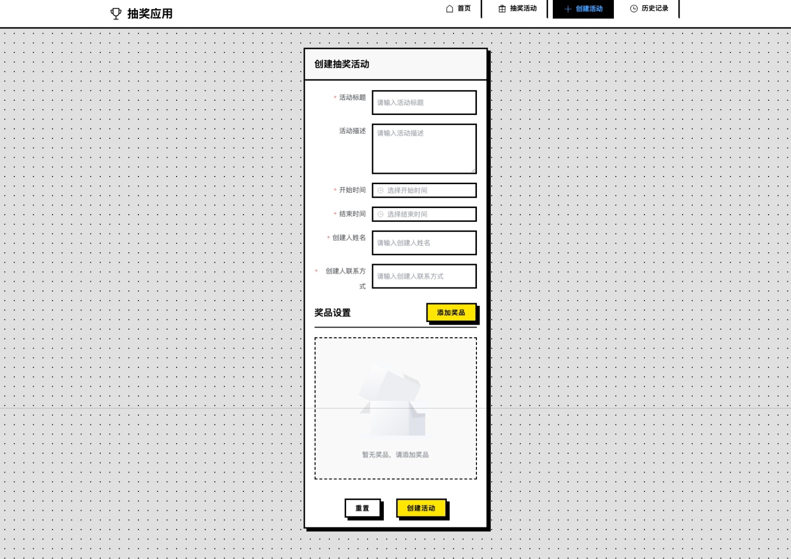
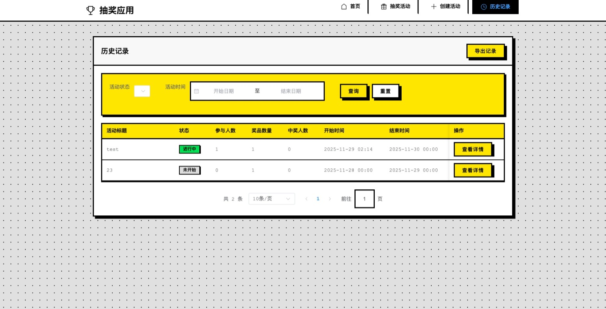

# 抽奖应用

一个基于 FastAPI + Vue3 + TypeScript 的现代化抽奖系统，提供完整的抽奖活动管理功能。

## 项目截图





## 项目结构

```
file/
├── backend/                 # 后端代码
│   ├── app/
│   │   ├── api/            # API路由
│   │   ├── core/           # 核心配置
│   │   ├── models/         # 数据模型
│   │   ├── schemas/        # Pydantic模式
│   │   ├── services/       # 业务逻辑
│   │   ├── utils/          # 工具函数
│   │   ├── db_init.py      # 数据库初始化
│   │   └── main.py         # 应用入口
│   ├── requirements.txt    # Python依赖
│   └── alembic/            # 数据库迁移
└── frontend/               # 前端代码
    ├── src/
    │   ├── api/            # API请求
    │   ├── components/     # 组件
    │   ├── router/         # 路由配置
    │   ├── store/          # 状态管理
    │   ├── utils/          # 工具函数
    │   ├── views/          # 页面视图
    │   ├── App.vue         # 根组件
    │   └── main.ts         # 应用入口
    ├── public/             # 静态资源
    ├── package.json        # 依赖配置
    ├── vite.config.ts      # Vite配置
    └── tsconfig.json       # TypeScript配置
```

## 功能特性

### 核心功能
- **抽奖活动管理**：创建、查看、开始和结束抽奖活动
- **奖品管理**：添加、编辑和删除奖品，支持多等级奖品设置
- **参与者管理**：参与者注册和信息查看
- **抽奖执行**：随机抽取中奖者，支持多轮抽奖
- **历史记录查询**：查看抽奖活动历史和中奖记录

### 界面特性
- **响应式设计**：完美适配桌面端和移动端
- **现代化UI**：基于Element Plus的美观界面
- **实时更新**：抽奖结果实时显示
- **用户友好**：简洁直观的操作流程

## 技术栈

### 后端
- FastAPI - 现代高性能Web框架
- SQLAlchemy - ORM框架
- Alembic - 数据库迁移工具
- Pydantic - 数据验证
- SQLite - 轻量级数据库

### 前端
- Vue3 - 渐进式JavaScript框架
- TypeScript - 类型安全的JavaScript
- Element Plus - Vue3 UI组件库
- Pinia - 状态管理
- Vue Router - 路由管理
- Axios - HTTP客户端
- Vite - 构建工具

## 快速开始

### 后端启动

1. 进入后端目录
```bash
cd backend
```

2. 创建虚拟环境（推荐）
```bash
python -m venv venv
source venv/bin/activate  # Linux/Mac
# 或
venv\Scripts\activate     # Windows
```

3. 安装依赖
```bash
pip install -r requirements.txt
```

4. 初始化数据库
```bash
python -m app.db_init
```

5. 启动后端服务
```bash
uvicorn app.main:app --reload --host 0.0.0.0 --port 8000
```

后端API文档将在 http://localhost:8000/docs 可访问

### 前端启动

1. 进入前端目录
```bash
cd frontend
```

2. 安装依赖
```bash
npm install
```

3. 启动开发服务器
```bash
npm run dev
```

前端应用将在 http://localhost:3000 可访问

## API文档

启动后端服务后，可以通过以下地址访问API文档：
- Swagger UI: http://localhost:8000/docs
- ReDoc: http://localhost:8000/redoc

## 开发指南

### 后端开发

1. 添加新的API端点：
   - 在 `app/api/` 目录下创建新的路由文件
   - 在 `app/schemas/` 目录下定义Pydantic模型
   - 在 `app/services/` 目录下实现业务逻辑

2. 数据库迁移：
   ```bash
   # 创建新的迁移文件
   alembic revision --autogenerate -m "描述"
   
   # 应用迁移
   alembic upgrade head
   ```

### 前端开发

1. 添加新页面：
   - 在 `src/views/` 目录下创建新的视图组件
   - 在 `src/router/index.ts` 中添加路由配置

2. 状态管理：
   - 在 `src/store/` 目录下创建新的store模块
   - 使用Pinia进行状态管理

3. API请求：
   - 在 `src/api/modules.ts` 中添加新的API请求函数
   - 使用封装好的axios实例进行HTTP请求

## 使用说明

### 创建抽奖活动
1. 访问创建活动页面
2. 填写活动标题、描述、时间范围和创建人信息
3. 添加奖品（名称、数量、等级）
4. 点击"创建活动"按钮

### 参与抽奖
1. 在活动列表中选择要参与的活动
2. 点击"参与抽奖"按钮
3. 填写参与者信息
4. 提交信息完成注册

### 执行抽奖
1. 进入活动详情页面
2. 点击"开始抽奖"按钮
3. 系统将随机抽取中奖者
4. 查看抽奖结果和中奖名单

## 部署

### 后端部署

1. 安装生产环境依赖
```bash
pip install gunicorn
```

2. 使用Gunicorn启动服务
```bash
gunicorn app.main:app -w 4 -k uvicorn.workers.UvicornWorker --bind 0.0.0.0:8000
```

3. 使用Docker部署（可选）
```bash
# 构建镜像
docker build -t raffle-backend ./backend

# 运行容器
docker run -d -p 8000:8000 -v $(pwd)/backend/raffle.db:/app/raffle.db raffle-backend
```

### 前端部署

1. 构建生产版本
```bash
npm run build
```

2. 使用Nginx或其他Web服务器托管 `dist` 目录

3. 使用Docker部署（可选）
```bash
# 构建镜像
docker build -t raffle-frontend ./frontend

# 运行容器
docker run -d -p 3000:80 raffle-frontend
```

### Docker Compose 部署（推荐）

我们提供了完整的Docker部署方案，支持开发和生产环境。

#### 快速开始

1. 确保已安装Docker和Docker Compose

2. 使用部署脚本（推荐）
```bash
# 开发环境部署
./deploy.sh deploy dev

# 生产环境部署
./deploy.sh deploy prod
```

3. 或手动使用Docker Compose
```bash
# 开发环境
docker-compose up --build -d

# 生产环境
docker-compose -f docker-compose.prod.yml up --build -d
```

#### 部署脚本使用

```bash
# 部署应用
./deploy.sh deploy [env]  # env: dev|prod, 默认: dev

# 停止服务
./deploy.sh stop

# 查看日志
./deploy.sh logs [service]  # service: backend|frontend, 可选

# 更新服务
./deploy.sh update [env]  # env: dev|prod, 默认: dev

# 清理资源
./deploy.sh cleanup

# 显示帮助
./deploy.sh help
```

#### 生产环境配置

1. SSL证书配置（可选）
   - 将SSL证书文件放置在 `nginx/ssl/` 目录下
   - 证书文件名应为: `cert.pem` 和 `key.pem`

2. 数据持久化
   - 生产环境数据将保存在Docker卷中
   - 如需自定义数据存储位置，请修改 `docker-compose.prod.yml` 中的卷配置

3. 环境变量配置
   - 可通过环境变量配置数据库连接等参数
   - 参考后端代码中的环境变量定义

## 常见问题

### Q: 如何修改抽奖算法？
A: 抽奖算法位于后端的抽奖服务中，可以根据需求修改随机抽取逻辑。

### Q: 如何添加新的奖品类型？
A: 在后端的数据模型中添加新的奖品类型字段，并更新前端界面。

### Q: 如何导出抽奖结果？
A: 可以在活动详情页面添加导出功能，支持Excel或CSV格式。

## 贡献指南

欢迎提交Issue和Pull Request来改进项目！

1. Fork 本仓库
2. 创建特性分支 (`git checkout -b feature/AmazingFeature`)
3. 提交更改 (`git commit -m 'Add some AmazingFeature'`)
4. 推送到分支 (`git push origin feature/AmazingFeature`)
5. 开启 Pull Request

## 许可证

MIT License